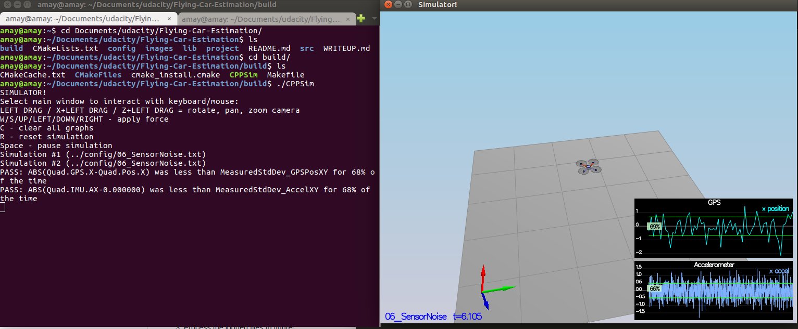
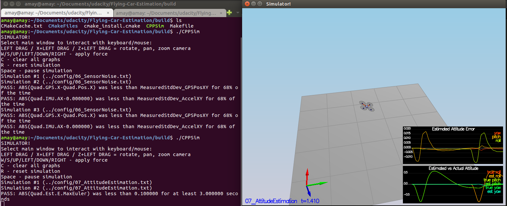
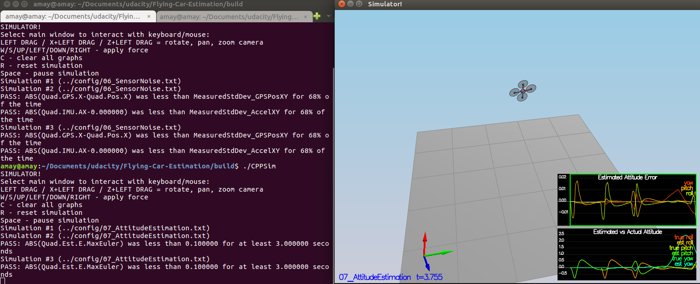
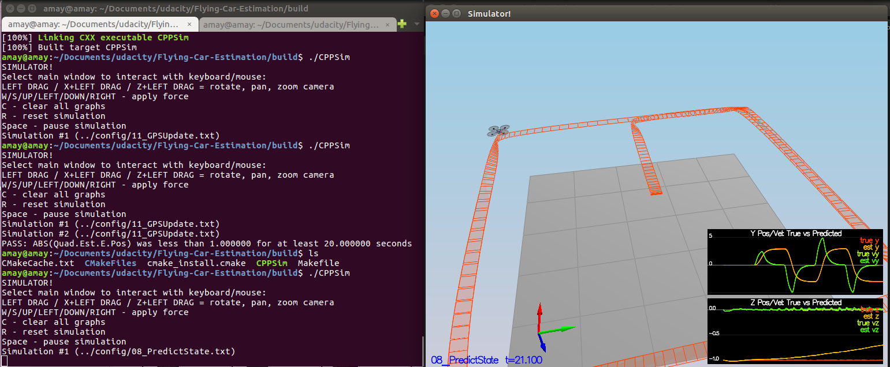
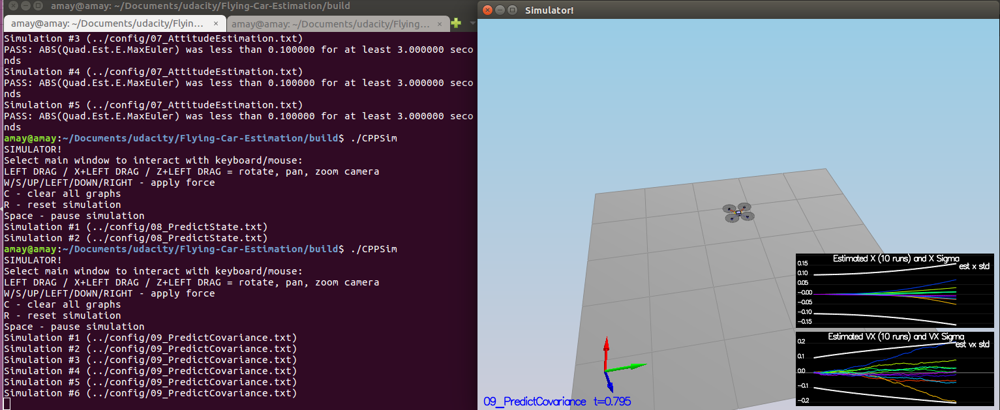
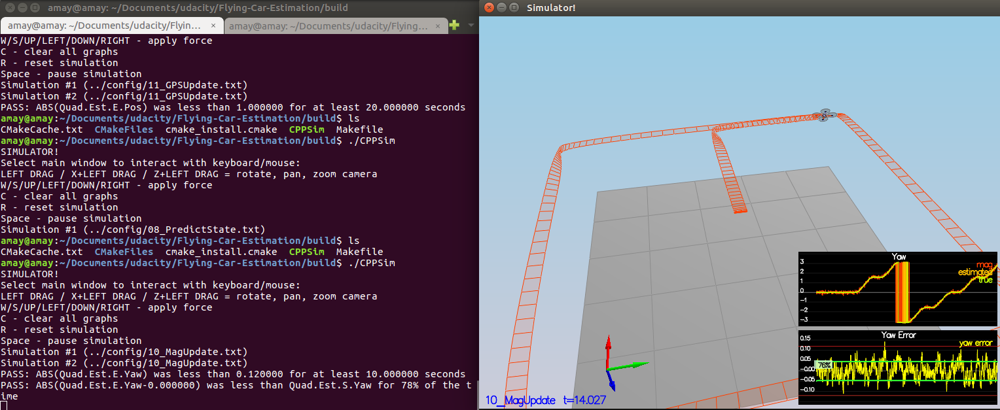
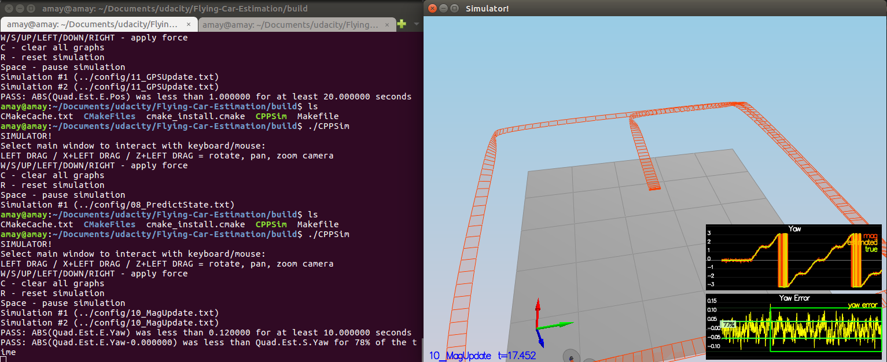
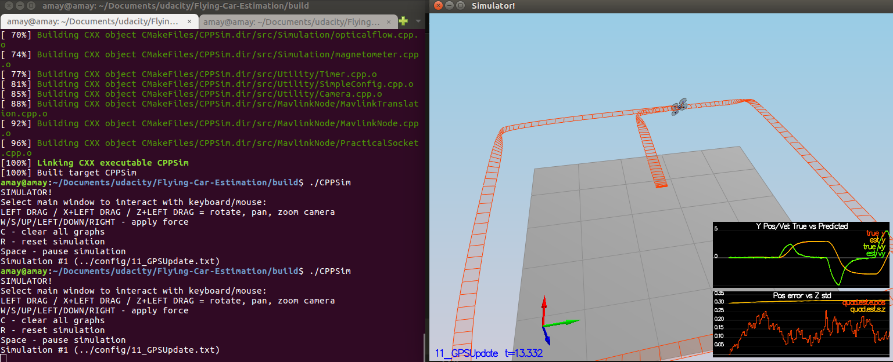
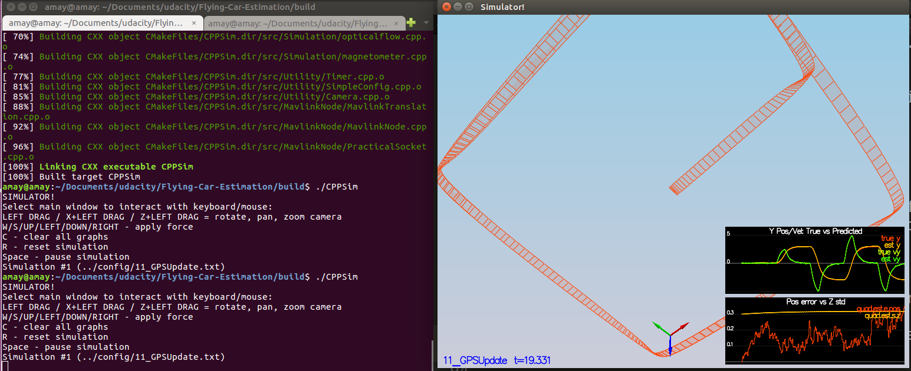
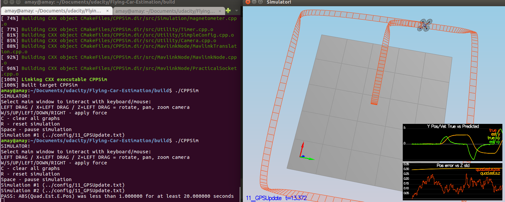

## Project: Quadcopter EKF Estimation

---

# Required Steps for a Passing Submission:
1. Add a CMakeLists.txt and build the project into build folder
2. Determine the standard deviation of the measurement noise of both GPS X data and Accelerometer X data.
3. Implement a better rate gyro attitude integration scheme in the UpdateFromIMU() function.
4. Implement all of the elements of the prediction step for the estimator.
5. Implement the magnetometer update.
6. Implement the GPS update.
7. Write it up.
8. Congratulations!  Your Done!

## [Rubric](https://review.udacity.com/#!/rubrics/1534/view) Points
### Here I will consider the rubric points individually and describe how I addressed each point in my implementation.  

---
### Writeup / README

#### 1. Provide a Writeup / README that includes all the rubric points and how you addressed each one.  You can submit your writeup as markdown or pdf.  

You're reading it! Below I describe how I addressed each rubric point and where in my code each point is handled.

#### 1. Explain this project.

In this project, we will be developing an estimator to be used by your controller to successfully fly a desired flight path using realistic sensors. This project builds on top of the control project to get us closer to the real-world situation where noise exists. We use an Extended Kalman Filter(EKF), noisy GPS, IMU, and compass(magnetometer) to estimate current drone position, velocity, and yaw.

Implementation of Estimator

[QuadControlParams.txt](./config/QuadControlParams.txt): This file contains the configuration for the controller.

[QuadEstimatorEKF.txt](./config/QuadEstimatorEKF.txt): This file contains the estimator parameters.

[QuadControl.cpp](./src/QuadControl.cpp): This is where we use the configuration and tune the parameters to control the drone. All the rubric points for this project can be convered in this C++ code. I have implemented Body Rate Control, Roll Pitch Control, Altitude Control, Lateral Position control and Yaw Control in QuadControl.cpp. I have copied this from my previous assignment related to [Quadcopter controler](https://github.com/Amay22/Flying-Car-Quadcopter-Controller).

[QuadEstimatorEKF.cpp](./src/QuadEstimatorEKF.cpp): This is the Extended Kalman Filter(EKF) implementation with steps for prediction and GPS udates.

### The Tasks

#### Step 1: Sensor Noise

Determine Standard deviation of the measurement noise of both GPS X data and Accelerometer X data. For this to work the original params in [06_SensorNoise.txt](./config/06_SensorNoise.txt) needs to be modified. I first ran simulation with with the provided values and I was not able to hit then I observed the graph and saw that the values for MeasuredStdDev_GPSPosXY is consistently between 0.5 to 0.9 and I changed it to around 0.67 which is approximately the mean of those two. MeasuredStdDev_AccelXY was set to 0.1 previously but it was too low to hit the range of the sinusoidal wave was way higher so I updated it 0.49 which was very close 0.5.

- MeasuredStdDev_GPSPosXY was reduced from 2 to 0.67.
- MeasuredStdDev_AccelXY was increased from 0.1 to 0.49.

The simulator passes as the MeasuredStdDev_GPSPosXY and MeasuredStdDev_AccelXY is lesser 68% of the time as illustrated in the following diagram.

#### Step 2: Attitude Estimation

Attitude estimation can be acheived by better rate gyro attitude integration scheme in the `UpdateFromIMU()` function. The integration scheme should result in an attitude estimator of < 0.1 rad for each of the Euler angles for a duration of at least 3 seconds during the simulation. The integration scheme should use quaternions to improve performance over the current simple integration scheme. The Attitude Estimation step and it's relevant code can be summarized as follows:

- Use quaternions as integration scheme to improve performance over current simple integration scheme
- Compute predictedPitch, predictedRoll and ekfState(6) using Quaternion Roll, Pitch and Yaw

#### Step 3: Prediction Step

In this step we implement all the prediction steps for the estimator. This can be done in the `Predict()`, `PredictState()` and `GetRbgPrime()`functions. The prediction step should include the state update element (PredictState() function), a correct calculation of the Rgb prime matrix, and a proper update of the state covariance. The acceleration should be accounted for as a command in the calculation of gPrime. The covariance update should follow the classic EKF update equation. The Prediction Step and it's relevant code can be summarized as follows:

1. Predict() function:
    - Predict the current covariance forward by dt using the current accelerations and body rates as input.
    - Compute `gPrime` using Transition and Jacobian reference.
    - Compute state covariance using gPrime
2. PredictState() function:
    - predict x, y, z (3 states)
    - attitude.Rotate_BtoI(<V3F>) to rotate a vector from body frame to inertial frame
    - predict x_dot, y_dot, z_dot (3 states)
    - yaw get updated in IMU code (1 state)
3. GetRbgPrime() function:
    - Compute partial derivative of the Rbg rotation matrix with respect to yaw. 
    - Use the pitch, roll and yaw to compute the RbgPrime matrix.

Predict State

Predict Covariance

#### Step 4: Magnetometer Update

This step is to only udate magnetometer value into the state. This is implemented in the `UpdateFromMag()` function. The Magnetometer Update Step and it's relevant code can be summarized as follows:

- Get yaw estimates from ekfState.
- Normalize the difference between your measured and estimated yaw to -pi .. pi
- Update Partial Derivative of Mesurement model i.e hPrime(0,6) with the value 1.

 

 

#### Step 5: Closed Loop + GPS Update

This step is to only udate GPS value into the state. This is implemented in the `UpdateFromGPS()` function. The Closed Loop + GPS Update Step and it's relevant code can be summarized as follows:

- Get yaw estimates from ekfState.
- Update Partial Derivative of Mesurement model i.e hPrime matrix with the value 1 diagonally.

 
 
 

#### Step 6: Adding Your Controller

I started with this step and so I didn't have to do much in this step. It was all already working. I just had to add normalizate yaw control and de-tune the controller to successfully fly the final desired box trajectory with the estimator and realistic sensors.